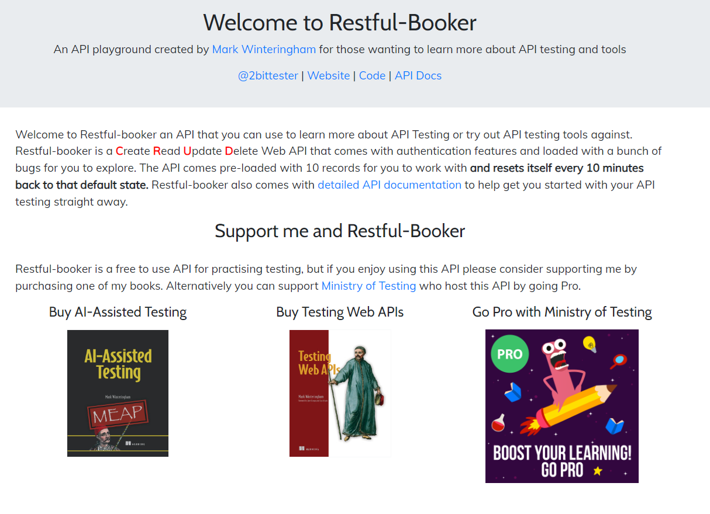
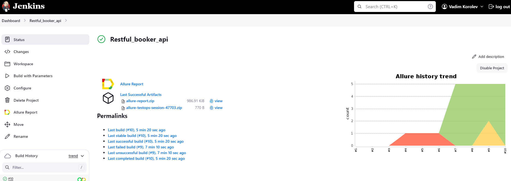
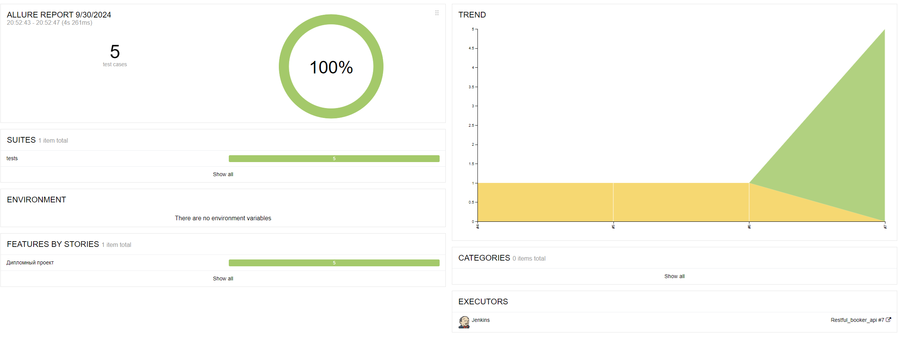
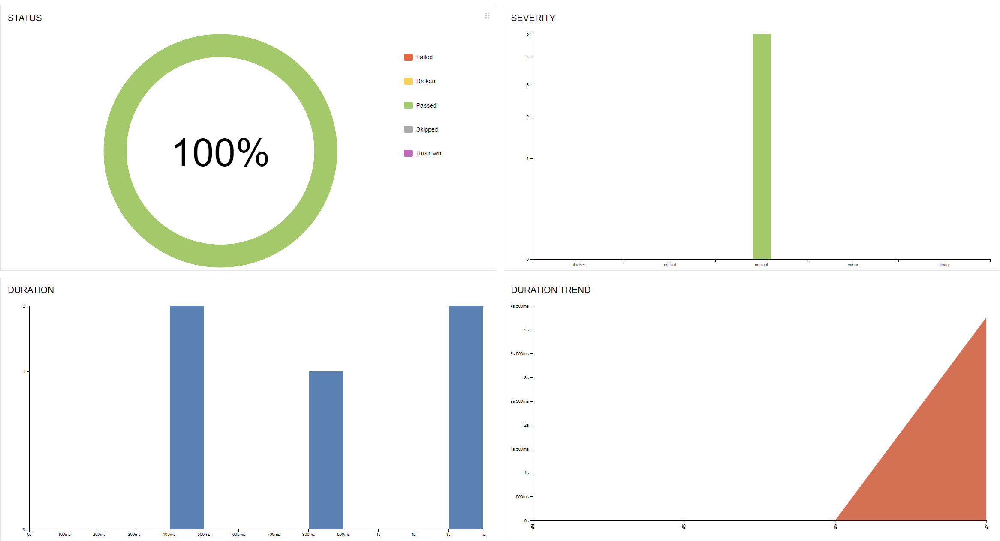
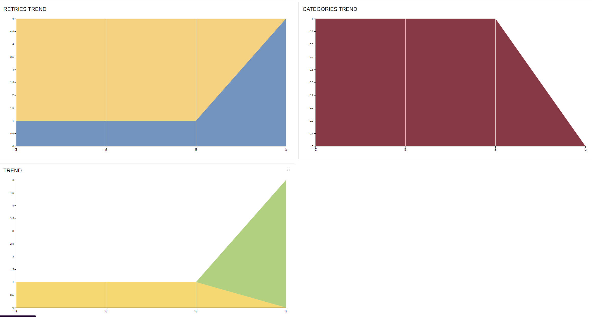
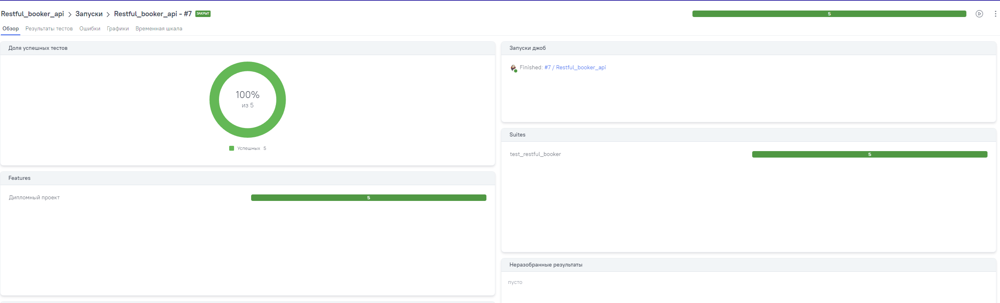
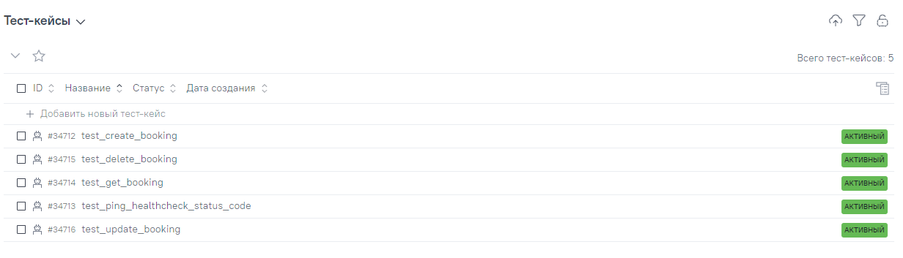
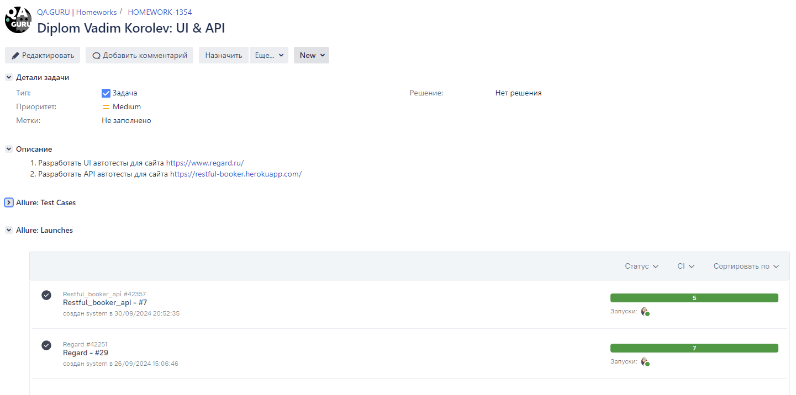
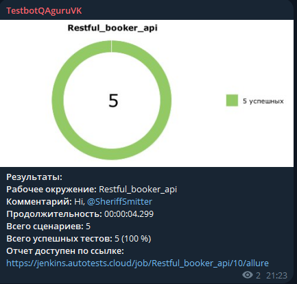

# Проект по тестированию API Restful-booker.

><a target="_blank" href="https://restful-booker.herokuapp.com/apidoc/index.html#api-Auth">Restful-booker</a>
> 

---
### Список проверок, реализованных в автотестах
1. Получение информации о бронировании по id.
2. Healthcheck проверка.
3. Создание бронирования.
4. Удаление бронирования.
5. Изменение существующего бронирования.

---

### Используемые инструменты
        

---

### Запуск автотестов осуществляется с использованием Jenkins
> [Ссылка на сборку в Jenkins](https://jenkins.autotests.cloud/job/Restful_booker_api/)

#### Для запуска автотестов в Jenkins
1. Открыть [задачу в Jenkins](https://jenkins.autotests.cloud/job/Restful_booker_api/)

2. Нажать "**Build Now**".

---

### Allure отчет

---

### Интеграция с Allure TestOps

> [Job #4397 Vadim Korolev Petstore api](https://allure.autotests.cloud/project/4462)

---

### Интеграция с Jira
> [Задача в Jira](https://jira.autotests.cloud/browse/HOMEWORK-1331)
 

---

### Уведомления в Телеграм

